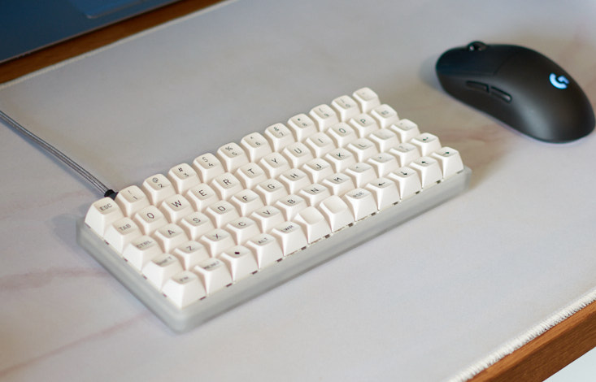
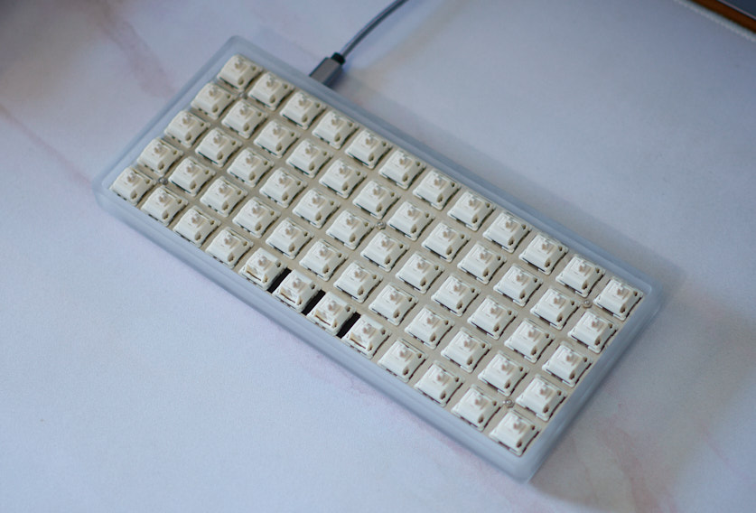
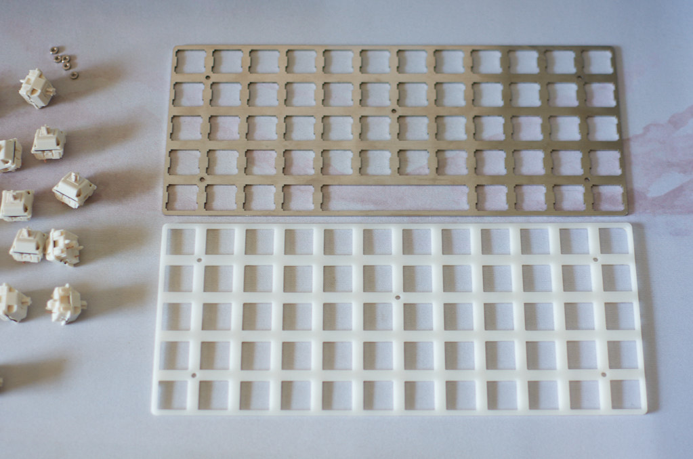

I had a $5 reward from Drop which gave me an excuse to purchase the [preonic](https://drop.com/buy/preonic-mechanical-keyboard) keyboard kit. A popular keyboard that can be configured in a 5\*12 ortholinear grid. This post details my pursuit of the &quot;perfect&quot; keyboard sound/feel based on my preferences.

### Starting point

I opted for the acrylic case with the included stainless steel plate mounted using the &quot;extra secure&quot; method. For switches I went with the snow-whites which are a custom JWK linear with 64g springs. The switches were lubed with Krytox 205G0 to remove the slight scratch that was present. Thicc films were installed as there was a decent amount of stem wobble. Case and plate foam from [StupidFish](https://stupidfish.design/collections/keyboard-foams/products/preonic-v3-case-and-plate-foam-set) was also applied as it sounded quite hollow without. This was a great starting point but the stainless plate was quite stiff and didn't produce the sound I was looking for.



### CAD is scary

Did some research and found that a POM (Delrin) plate seemed to achieve a deep, semi-quiet sound profile. Not a common material used in keyboards so it would require that I bust open AutoCAD and create the plate file to be laser cut. Luckily I was able to find a good starting point on GitHub which had [plate files](https://github.com/vnz/mkb-plates/tree/main/preonic) for a Preonic. The only problem was that the screw holes were not in the right location and the spacebar was 2U. It was simple enough for a CAD novice like myself to change the hole placement and make the bottom row full grid. Uploaded the file to Ponoko to be printed in 1.5mm thick white delrin and patiently waited for arrival. The cost was right around $40 if you&apos;re curious.



### Conclusion

Overall the build was a success as I&apos;m happy with the way it sounds. The board is quiet enough for office duty but still provides a nice deep tone. As for feel, the POM plate has more of a rebound effect and is not nearly as stiff as the included stainless one.
